# Instalación del compilador

Dependiendo de nuestro sistema operativo, la configuración a seguir será distinta. 

## Windows

La forma más simple de obtener un compilador de C/C++ en Windows es usando **MinGW** (Minimalist GNU for Windows). MinGW nos permite compilar programas escritos en C o C++ para que funcionen correctamente en Windows, proporcionando las herramientas básicas necesarias, entre ellas el compilador de C conocido como `gcc`.

Actualmente, MinGW suele instalarse y utilizarse a través de **MSYS2** (Minimalist System 2), una plataforma que facilita la instalación del compilador y otras herramientas útiles, evitando configuraciones complicadas. Como dato curioso, MSYS2 proporciona un entorno similar al de Linux, lo que permite usar herramientas y comandos típicos de ese sistema operativo dentro de Windows.

### Pasos:

#### Paso 1: Instalar MSYS2

1. Haz click [<u>aquí</u>](https://github.com/msys2/msys2-installer/releases/download/2025-12-13/msys2-x86_64-20251213.exe) para descargar el instalador de MSYS2.

2. Ejecuta el instalador y sigue los siguientes pasos para instalarlo.

   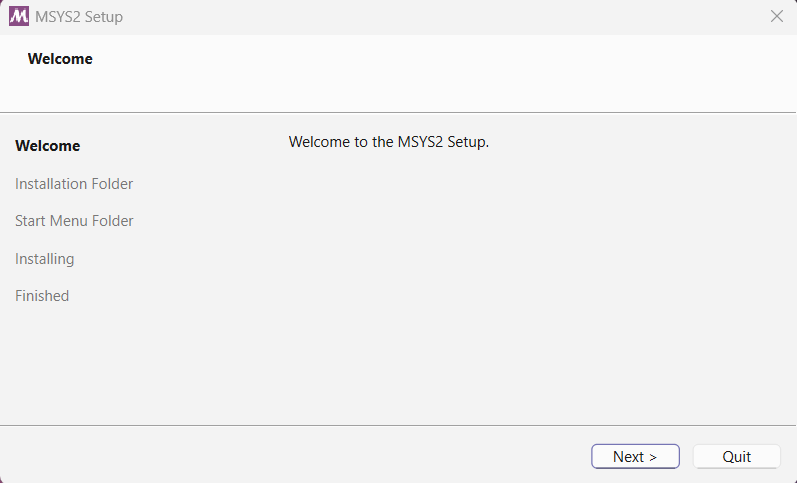

   El directorio que yo elegí para instalarlo es `C:\Program Files\MSYS2`. Puedes usar el mismo path, pero si decides cambiarlo, recuérdalo porque lo usaremos en un momento.

   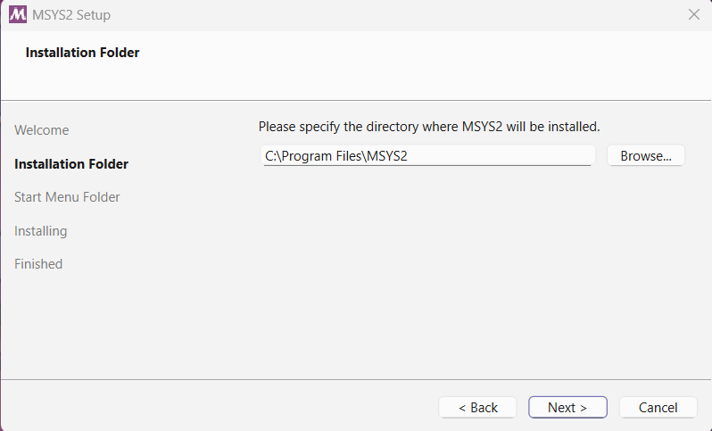

   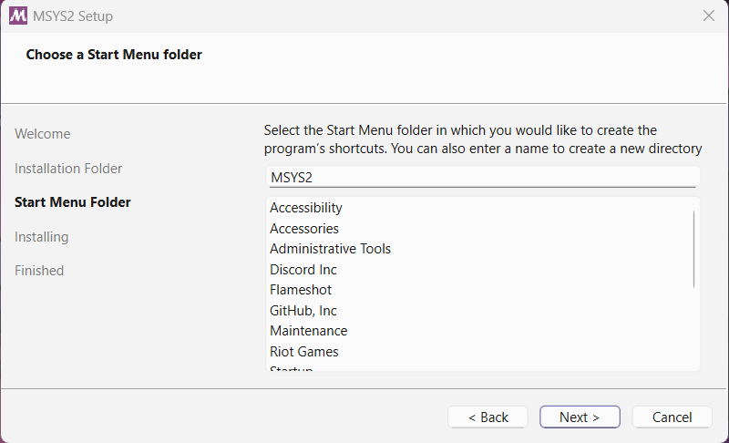

   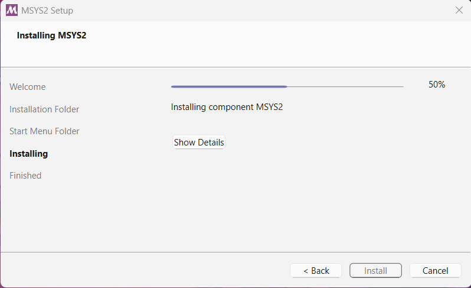

   Una vez instalado simplemente pulsa **Cerrar**.

   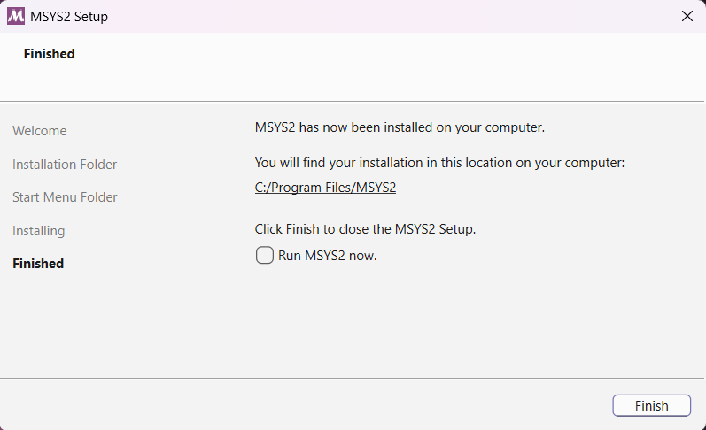

#### Paso 2: Instalar MINGW

A continuación instalaremos **MinGW**, para ello sigue los siguientes pasos.

   1. En el Menú de Inicio busca **MSYS2 MINGW64** y ejecútala como administrador.

      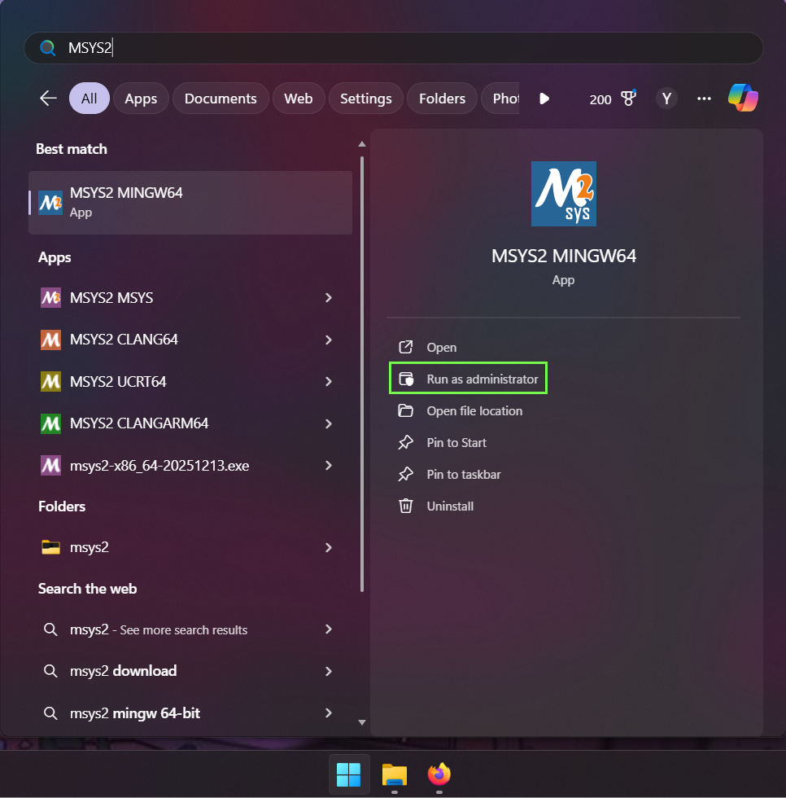

   2. En la terminal que se abre introduce el siguiente comando (`clic derecho` → `pegar`).

      ```bash
      pacman -S --needed base-devel mingw-w64-ucrt-x86_64-toolchain
      ```

      - `pacman` es un manejador de paquetes; considérelo como una Play Store / App Store que funciona en la terminal.
      - `-S` es un argumento que le indica a `pacman` que vamos a instalar programas. Se conoce como `modo sync` y sirve para sincronizar paquetes desde un repositorio.
      - `--needed` especifica que solo se instalen los paquetes que aún no están instalados.
      - `base-devel` y `mingw-w64-ucrt-x86_64-toolchain` son los conjuntos de paquetes que se van a instalar. El primero instala el compilador `gcc` y otras herramientas básicas para desarrollar programas, mientras que el segundo instala versiones de esas herramientas y un compilador específicos para Windows.z

      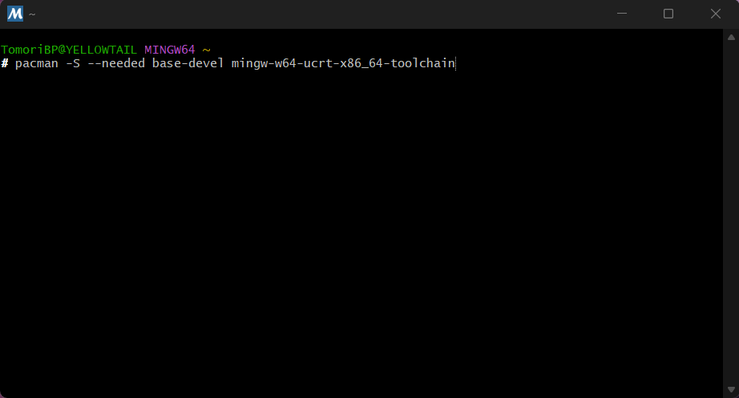

   3. Una vez presionamos `Enter`, se nos muestra un mensaje indicando cuáles de todas las herramientas de `mingw-w64-ucrt-x86_64-toolchain` queremos instalar. Simplemente volvemos a presionar `Enter` para que se instalen todas.

      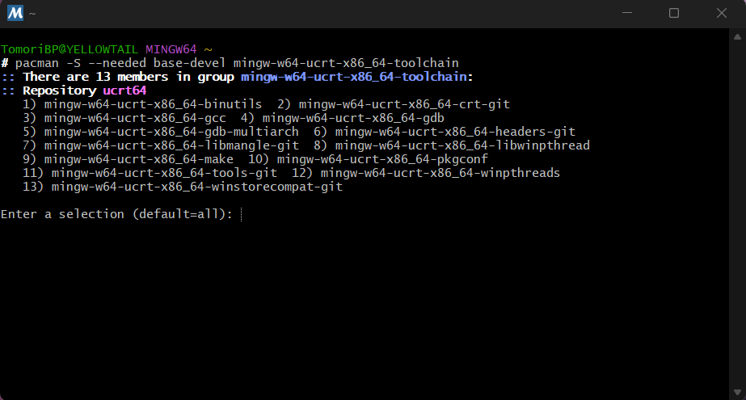

   4. Posteriormente, introducimos `Y` para continuar con la instalación.

      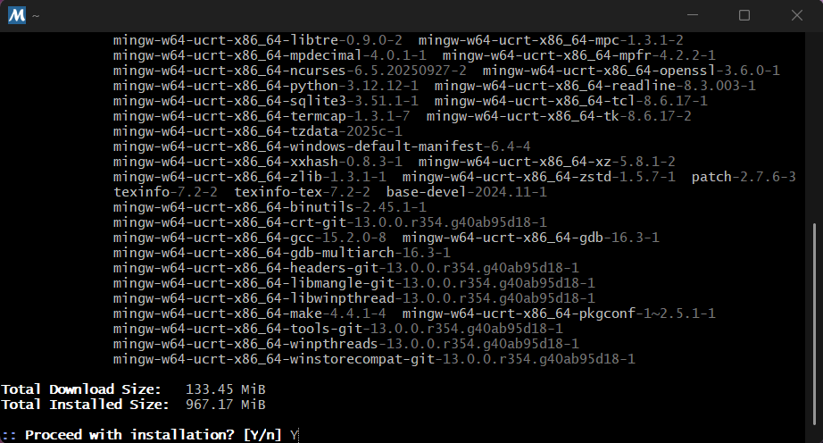

   5. Una vez termine la instalación simplemente cierra la terminal.

      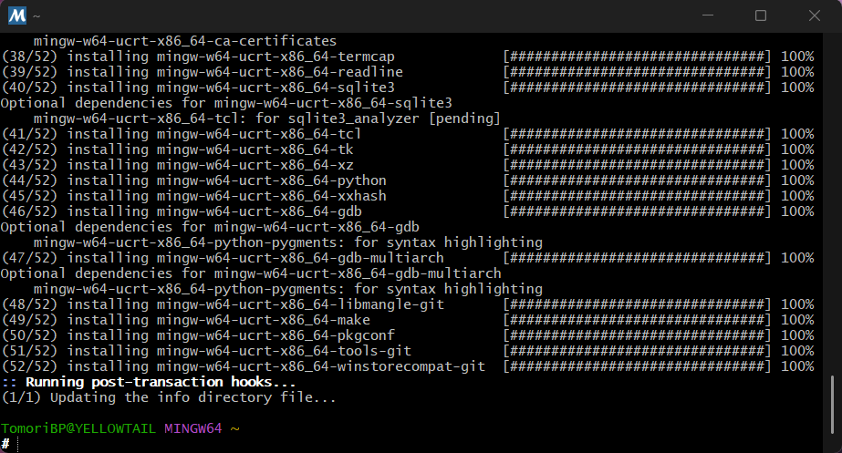

#### Paso 3: Configurar las variables de entorno

Por último, debemos indicarle a Windows dónde está instalado el compilador de C/C++ para poder usarlo desde la terminal en cualquier directorio.

   1. En el Menú de Inicio busca **Variables de entorno**.

      

   2. En la sección de **Variables de usuario**, busca la opción `Path` y luego pulsa `Editar`.

      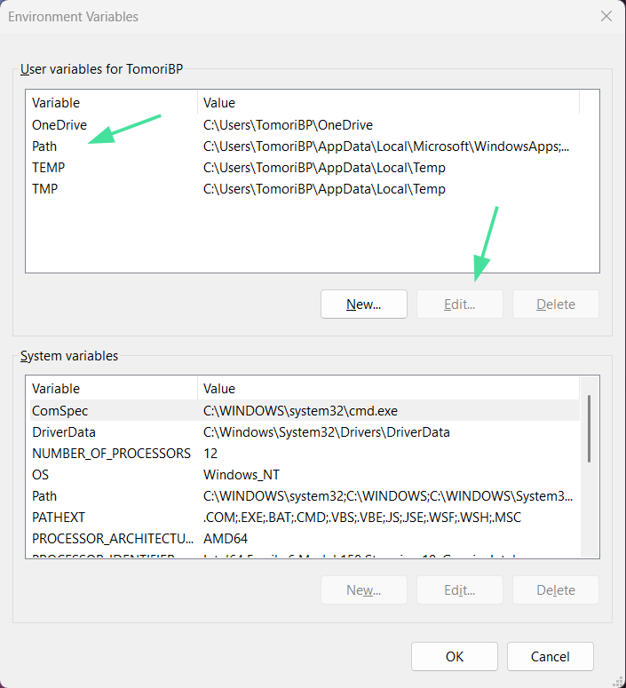

   3. En la segunda ventana, pulsa en `Nueva` y agrega el **path** donde instalaste MSYS2, seguido de `\ucrt64\bin`.  
      Si usaste el mismo path que yo, simplemente copia lo siguiente:  
      `C:\Program Files\MSYS2\ucrt64\bin`.

      Este path incluye el directorio donde están instaladas todas las herramientas necesarias para crear programas en C/C++ en Windows.

      

      

   4. Finalmente, presiona `Aceptar` en las dos ventanas que abriste para guardar los cambios. Ahora abre una terminal, ya sea Powershell o CMD, e introduce
      lo siguiente:

      ```
      gcc --version
      ```

      Como te había dicho al comenzar, el compilador de C se conoce como **gcc** y el argumento `--version` nos indica la versión del compilador. Si la instalación se completó correctamente entonces el resultado sera el siguiente:

      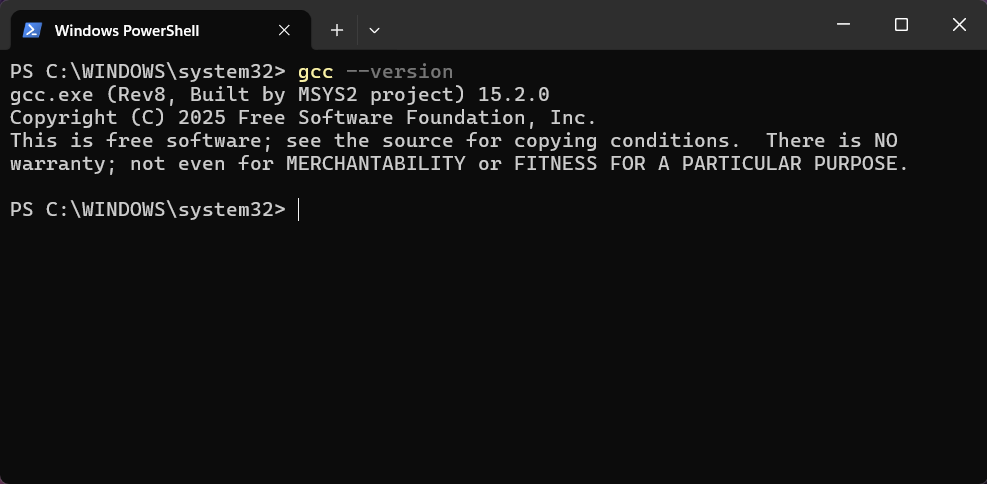

## Linux

Si usas alguna distribución de Linux lo mas probable es que ya tengas el compilador de C instalado. Puedes verificarlo al ejecutar el siguiente comando

```
gcc --version
```

En Arch Linux el resultado es el siguiente:

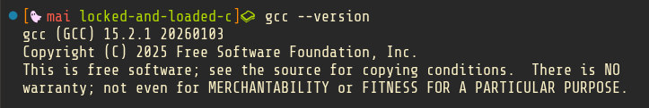

A continuacón te muestro como instalarlo en varias distribuciones de Linux en caso de que no lo tengas.

> El comando `sudo` significa "*superuser do*" y nos concede privilegios para instalar programas solo para ese comando. Piénsalo como si fueras un empleado de un supermercado y tuvieras que pedirle a tu jefe permiso para acceder a la caja registradora. Una vez que la caja se cierra al final del día, tendrás que volver a pedir permiso la siguiente vez.

### Distribuciones basadas en Debian / Ubuntu (Zorin OS, Mint, Pop! OS)
```bash
sudo apt update
sudo apt install build-essential
```
- `apt` es el manajador de paquetes para estas distribuciones.
- `update` actualiza la lista de programas y versiones disponibles desde los repositorios. Así, cuando instales algo, podrás obetner la versión mas reciente.
- `install` hace justo lo que su nombre dice, instala los paquetes que pongas después (si son varios, se separan con espacios).
- `build-essential` es un conjunto de herramientas de desarrollo que incluye el compilador `gcc` y otros programas necesarios para compilar software.

### Distribuciones basadas en Arch Linux (Manjaro, EndeavourOS, ArcoLinux)
```
sudo pacman -S --needed base-devel
```
- `pacman` es el manejador de paquetes de estas distribuciones.
- `-S` le indica a pacman que vamos a instalar paquetes desde los repositorios. Se conoce como modo sync porque sincroniza nuestra base de datos local con los repositorios antes de instalar.
- `--needed` especifica que solo se instalen los paquetes que aún no están instalados.
- `base-devel` es un conjunto de herramientas de desarrollo que incluye el compilador `gcc`, y es similar a `build-essential` en Ubuntu.

> Si eres observador, te darás cuenta de que el comando es muy similar al que se usa en Windows. Esto es porque MSYS2 se inspiró en Arch Linux, tanto en su manejador de paquetes (pacman) como en la forma de instalarlos.

### Distribuciones basadas en Fedora (Bazzite, Nobara)
```
sudo dnf install @development-tools
```
- `dnf` es el manejeador de paquetes de estas distribuciones.
- `install` es similar al comando de Ubuntu.
- `@` indica que vamos a instalar un grupo de paquetes, no solo uno.
- `@development-tools` es el conjunto de herramientas en distribuciones basadas en Fedora que incluye el compilador `gcc`.
